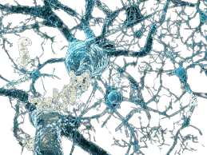

<!DOCTYPE html>
<html lang="pt">
<head>
<meta charset="UTF-8">
<meta name="viewport" content="width=device-width, initial-scale=1.0">
<title>Informações sobre Genes</title>

</head>
<body>

Caracterização do Gene APOE

  <h1>Gene APOE</h1>
  
A proteína codificada por este gene é uma apoproteína principal do quilomicron. Ela liga-se a um receptor específico no fígado e em células periféricas, <b>sendo essencial para o catabolismo normal dos constituintes das lipoproteínas ricas em triglicéridos</b>. Este gene está mapeado no cromossoma 19, num grupo com os genes relacionados da apolipoproteína C1 e C2. Mutações neste gene resultam em disbetalipoproteinemia familiar, ou hiperlipoproteinemia tipo III (HLP III), na qual o aumento do colesterol plasmático e dos triglicéridos é consequência da depuração prejudicada dos remanescentes do quilomicron e do VLDL.

  

    <a href="https://www.ncbi.nlm.nih.gov/gene/348/" target="_blank">Mais informações sobre o gene APOE</a>
  
 

  <h1>Proteína Apolipoproteína E</h1>
  
A proteína codificada por este gene é uma apoproteína principal do quilomicron. Ela liga-se a um receptor específico no fígado e em células periféricas, sendo essencial para o catabolismo normal dos constituintes das lipoproteínas ricas em triglicéridos. Este gene está mapeado no cromossoma 19, num grupo com os genes relacionados da apolipoproteína C1 e C2. Mutações neste gene resultam em disbetalipoproteinemia familiar, ou hiperlipoproteinemia tipo III (HLP III), na qual o aumento do colesterol plasmático e dos triglicéridos é consequência da depuração prejudicada dos remanescentes do quilomicron e do VLDL.

  

    <a href="https://www.uniprot.org/uniprotkb/P02649/entry" target="_blank">Mais informações sobre a Proteína Apolipoproteína E</a>
  

  <h1>Número de Transcritos</h1>
  
  
Quando um gene tem<b> 5 transcritos</b> , significa que ele produz 5 variantes diferentes de RNA mensageiro (mRNA) através do processo de transcrição. Essas variantes de mRNA podem resultar em diferentes proteínas ou exercer funções regulatórias diversas na célula. Isso indica uma complexidade na regulação da expressão genética e na diversidade funcional das moléculas produzidas por esse gene.

    

<title>Informações sobre Doenças Associadas ao Gene APOE</title>

</head>
<body>

  <h1>Doenças Associadas ao Gene APOE</h1>
  

<h2>Doença de Alzheimer</h2> ---

A <b>doença de Alzheimer</b> é a causa mais comum de demência em todo o mundo e está se tornando mais prevalente devido ao aumento da expectativa de vida. O gene da apolipoproteína E (APOE) é um dos fatores de risco genéticos mais fortes e prevalentes para a DA, afetando mais da metade de todos os casos. O alelo ε4 do gene APOE aumenta significativamente o risco de DA, enquanto o alelo ε2 é protetor em relação ao ε3 comum. Estes alelos do gene codificam três isoformas da proteína apoE, com funções primárias de mediar o transporte de lipídios no cérebro e na periferia. A apoE também está envolvida na formação de placas de amiloide-β (Aβ) no cérebro, sendo a apoE4 associada a placas mais precoces e abundantes. A interação entre APOE e Aβ desempenha um papel crucial na patogênese da DA, influenciando o desenvolvimento de placas amiloides e a progressão da doença. A complexidade da biologia da apoE apresenta desafios para o desenvolvimento de estratégias terapêuticas eficazes, com foco nos avanços recentes e ferramentas tecnológicas para direcionamento terapêutico.

  <h2>Outras Doenças Associadas ao Gene APOE</h2> ---
  
  
<b>Doença Cardiovascular:</b> O alelo ε4 do gene APOE também tem sido associado a um risco aumentado de doença cardiovascular, incluindo aterosclerose e doença cardíaca coronária.

  
<b>Hiperlipidemia:</b> Variações no gene APOE podem afetar os níveis de lipídios no sangue, contribuindo para o desenvolvimento de hiperlipidemia e hipercolesterolemia.

  <h2>Motifs</h2>
  
Os <b>motifs</b> são padrões ou sequências de nucleotídeos específicos encontrados em regiões regulatórias de genes. Eles desempenham um papel fundamental na regulação da expressão gênica, ligando-se a proteínas reguladoras e influenciando a transcrição e a atividade dos genes. A identificação e caracterização de motifs são importantes para entender os mecanismos de regulação gênica e para estudar processos biológicos complexos.

 <!--> -->

  <h2>Elementos Regulatórios Importantes</h2>
  
Explore os elementos regulatórios importantes do gene APOE nesta visualização interativa. Estes elementos desempenham um papel fundamental na regulação da expressão gênica e no controle da atividade do gene APOE, afetando a sua função e impactando vários processos biológicos.

  <a href="https://genome.ucsc.edu/cgi-bin/hgTracks?db=hg38&lastVirtModeType=default&lastVirtModeExtraState=&virtModeType=default&virtMode=0&nonVirtPosition=&position=chr19%3A44905796%2D44909393&hgsid=2255231788_KFT0uN5AjHPiaTaat7eth3sPC36T" target="_blank">Visualização Interativa dos Elementos Regulatórios</a>

<small>[**Voltar ao Menu inicial**](README.md)</small>
</body>
</html>